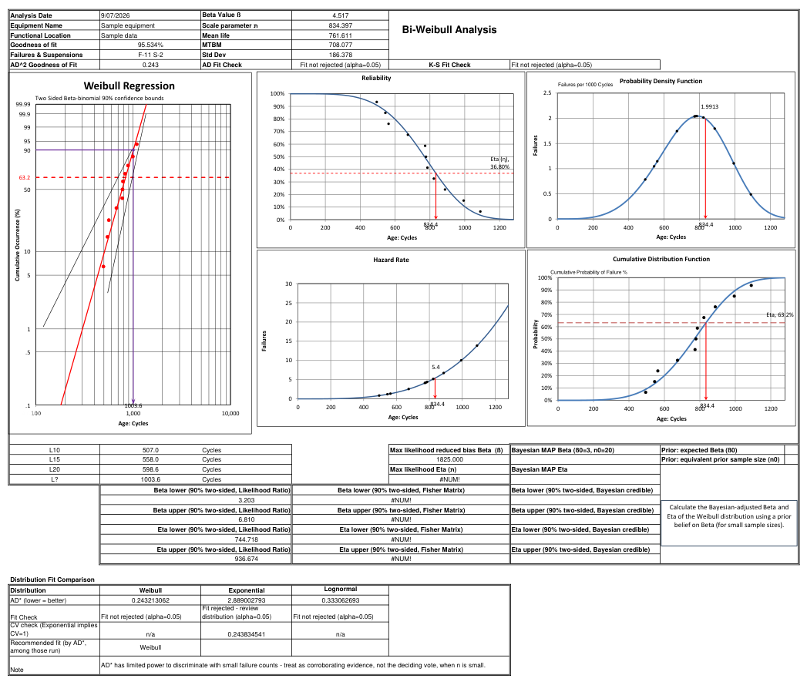
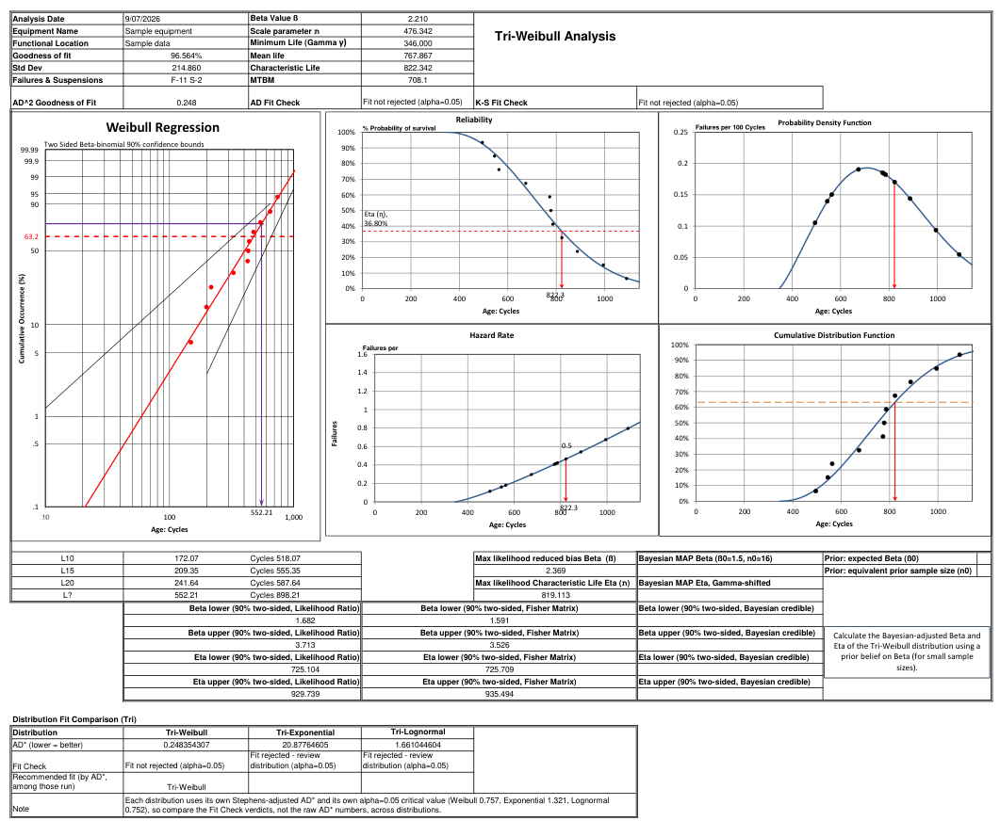
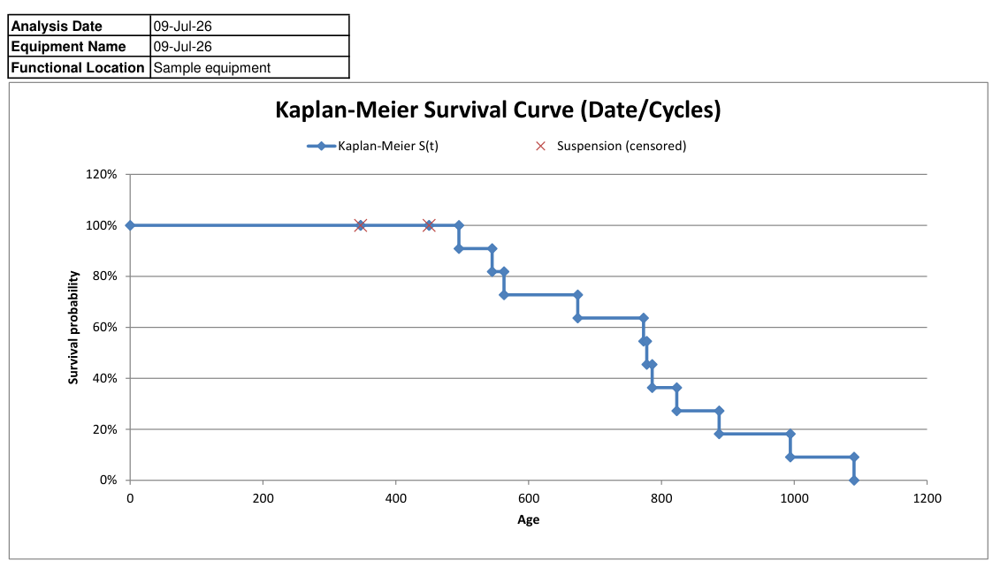
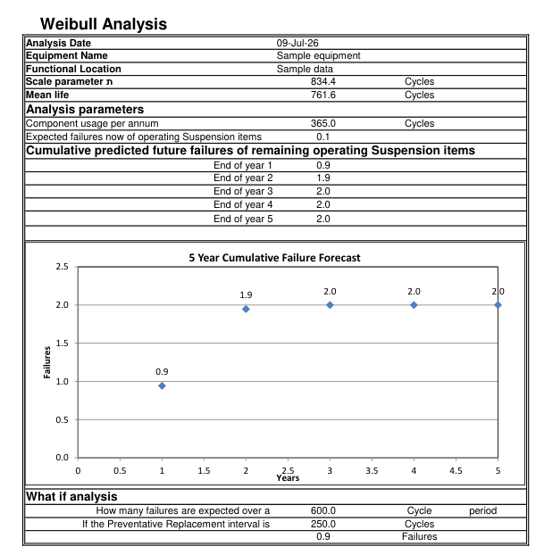
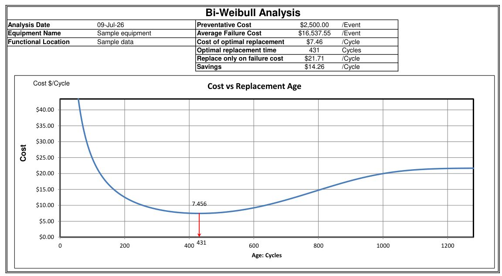
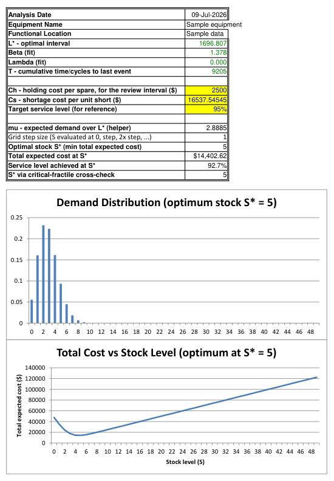
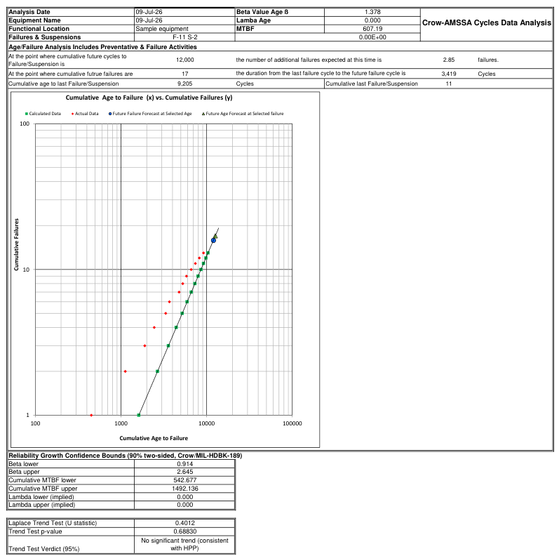
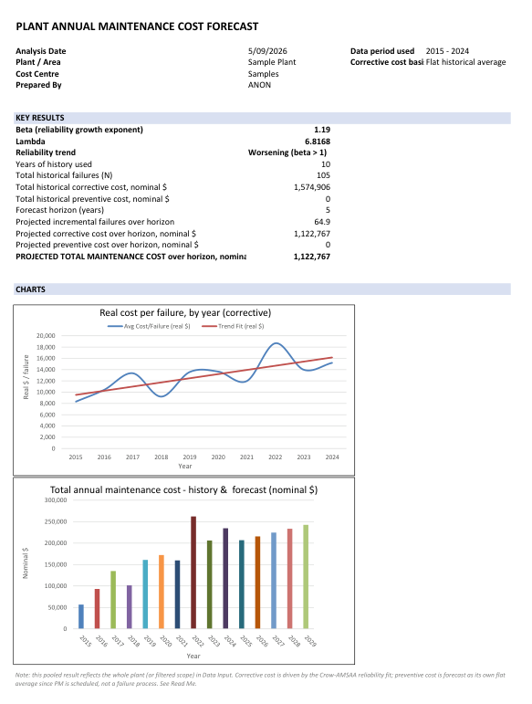

# Sample Output

Screenshots below are taken from the toolkit's PDF report export, run on the built-in sample dataset (cycles-based data, 11 failures / 2 suspensions). They're included to show what each analysis path actually produces, not just describe it.

## Life Data Analysis

**2-Parameter Weibull** — rank regression fit, confidence bounds (Fisher Matrix, Likelihood Ratio, Bayesian), and a Distribution Fit Comparison against Exponential and Lognormal on the same data.

**3-Parameter ("Tri") Weibull** — same layout, with a fitted minimum-life (location) parameter and Gamma-shifted Bayesian Eta bounds.

**Kaplan-Meier survival curve** — the non-parametric overlay, shown independently of any distributional assumption, for sanity-checking the parametric fit above.

## Forecasting & Cost Optimization

**5-year failure forecast** — cumulative predicted failures for the remaining in-service (suspended) population, plus an on-sheet "what-if" calculator for an arbitrary future interval.

**Cost vs. replacement age** — run-to-failure vs. planned-replacement cost tradeoff, with the optimal preventive replacement interval marked directly on the curve.

**Spares optimizer** — critical-fractile (newsvendor) stock-level optimization: expected demand distribution over the review interval, and total expected cost vs. stock level with the minimum marked.

## Reliability Growth (Crow-AMSAA)

**Cycles-based Crow-AMSAA analysis** — NHPP power-law fit on cumulative age vs. cumulative failures, Crow/MIL-HDBK-189 confidence bounds, and the Laplace trend test verdict (here: no significant trend, consistent with a homogeneous Poisson process).

## Plant-Level Maintenance Cost Forecast

**Multi-year CMMS-driven forecast** — corrective cost (Crow-AMSAA-driven) and preventive cost (flat average) modeled as separate streams, rolled up into a 5-year total maintenance cost projection, with the underlying charts (real cost per failure by year, and annual history + forecast) shown alongside the key results table.

---

*All figures above use the workbook's built-in sample dataset — no real equipment, plant, or cost data is shown.*
